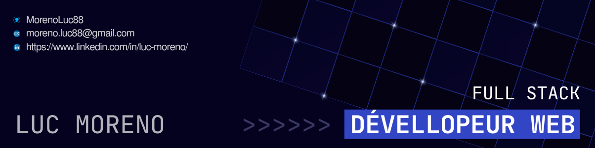

  

# 👋 Salut, moi c’est Luc Moreno !

Développeur web en reconversion, actuellement en formation intensive chez O’clock jusqu’à juillet 2025.  
Je suis passionné par l’innovation, l’UX, et j’aime donner vie à des idées à travers le code !

## 🚀 Compétences principales

- **Front-end** : HTML, CSS, JavaScript, Svelte
- **Back-end** : Node.js, Express, Sequelize
- **Base de données** : PostgreSQL
- **Outils** : Git, GitHub, Figma, VS Code

## 📂 Quelques projets

- [Ciné-Délices](https://github.com/MorenoLuc88/Cine_Delices)

## 🎯 Objectif

Je cherche un **stage en développement web** (front ou back) à partir du 21 juillet 2025 !  
Curieux, autonome, et prêt à m’investir sur des projets ambitieux.

## 📫 Contact

- Email : moreno.luc88@gmail.com
- [LinkedIn](https://linkedin.com/in/luc-moreno)

---

🌱 Toujours prêt à apprendre et relever de nouveaux défis !
