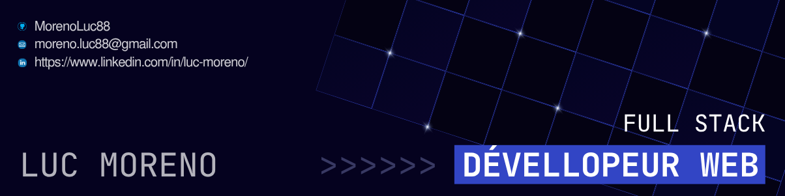

  

# Luc Moreno

**Développeur Full Stack & Photographe**

Je code des interfaces et je capture des instants.  
Deux disciplines, une seule exigence : le détail.

---

## Stack

**Front-end** — React, JavaScript, HTML/CSS, Tailwind  
**Back-end** — Node.js, Express, TypeScript  
**Base de données** — PostgreSQL, Prisma  
**Desktop** — Electron  
**Outils** — Git, GitHub, Figma, VS Code

---

## Projets

| Projet | Description | Stack |
|--------|-------------|-------|
| [LM Watermark](https://github.com/MorenoLuc88/watermark-app) | App desktop de filigrane automatique par lot — analyse la luminosité pour choisir blanc ou noir | Electron, Node.js, Sharp |
| [Ciné-Délices](https://github.com/MorenoLuc88/Cine_Delices) | Application de recommandation films & recettes | JavaScript, Node.js |

---

## Contact

- Email : [moreno.luc88@gmail.com](mailto:moreno.luc88@gmail.com)
- [LinkedIn](https://linkedin.com/in/luc-moreno)
- [lucmoreno.fr](https://lucmoreno.fr)
